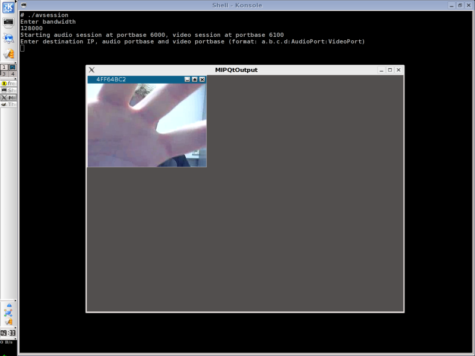
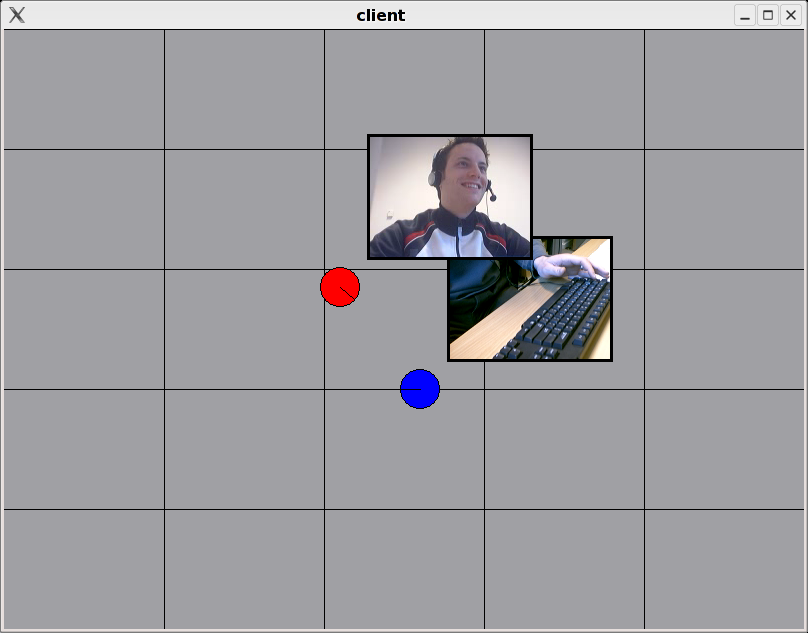
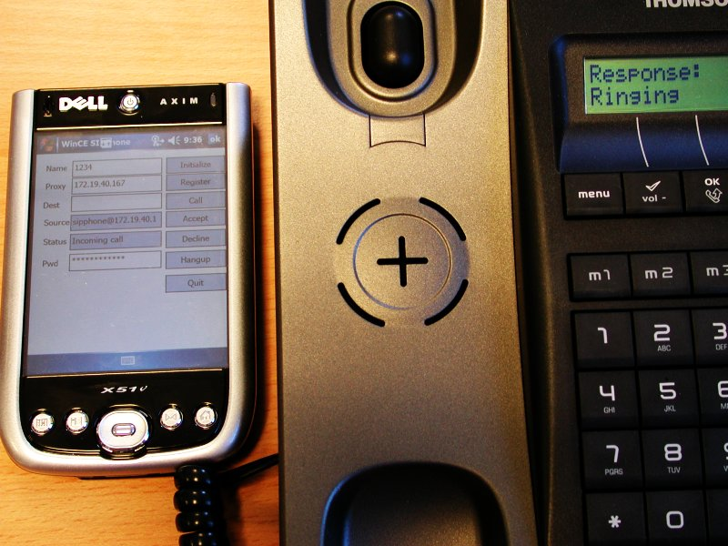

EMIPLIB
=======
	
Welcome to the home page of EMIPLIB.

Introduction
------------

The name EMIPLIB stands for _'EDM Media over IP library'_. This library was developed at the 
[Expertise Centre for Digital Media (EDM)](http://www.edm.uhasselt.be), a research 
institute of the [Hasselt University](http://www.uhasselt.be). As the name suggests, 
the goal of the library is to make it easier to stream several kinds of media, including (but 
not limited to) audio and video. 			

The latest version of the library is 1.2.0. You can take a look at the 
[ChangeLog](https://github.com/j0r1/EMIPLIB/blob/master/ChangeLog), or follow the
development of the library [at GitHub](https://github.com/j0r1/EMIPLIB).

Features
--------

Current features include:

 - Soundcard input (using [OSS](http://www.opensound.com/), 
   [WinMM](https://msdn.microsoft.com/en-us/library/windows/desktop/dd743834(v=vs.85).aspx),
   [Jack](http://jackit.sourceforge.net/) and 
   [PortAudio](http://www.portaudio.com/)
 - Soundcard output (using [OSS](http://www.opensound.com/), 
   [ALSA](http://www.alsa-project.org/)
   [ESD](http://ftp.gnome.org/pub/gnome/sources/esound/0.2/), 
   [WinMM](https://msdn.microsoft.com/en-us/library/windows/desktop/dd743834(v=vs.85).aspx),
   [Jack](http://jackit.sourceforge.net/),
   [SDL](http://www.libsdl.org/)
   and [PortAudio](http://www.portaudio.com/)
 - An [OpenAL](http://www.openal.org/) output component
 - WAV file input (using [libsndfile](http://www.mega-nerd.com/libsndfile/),
   [libaudiofile](http://www.68k.org/~michael/audiofile/)
   or a simple internal WAV reader)
 - WAV file output (using [libsndfile](http://www.mega-nerd.com/libsndfile/)
   or a simple internal WAV writer)
 - Webcam input (using [Video4Linux](http://linuxtv.org/v4lwiki/)
   and [DirectShow](https://msdn.microsoft.com/en-us/library/windows/desktop/dd375454(v=vs.85).aspx))
 - [Speex](http://www.speex.org/) compression
 - [Opus](http://opus-codec.org/) compression
 - U-law audio encoding
 - A-law audio encoding
 - LPC compression (code taken from JVOIPLIB, which is based on Ron Frederick's 
   [lpc.tar.Z](ftp://parcftp.xerox.com/pub/net-research/lpc.tar.Z) )
 - GSM 06.10 compression (code taken from JVOIPLIB, which is based on Jutta Degener 
   and Carsten Bormann's [work](http://kbs.cs.tu-berlin.de/~jutta/toast.html)
 - H.263+ compression (using [libavcodec](http://ffmpeg.org/libavcodec.html))
 - Mixing of incoming audio streams
 - Synchronization of RTP streams based on RTCP information
 - 3D sound effects using HRIR/HRTF data from the [LISTEN](http://recherche.ircam.fr/equipes/salles/listen/)
   project
 - Easy to use voice over IP (VoIP) and video over IP sessions

The library has been tested on the following platforms:
    
 - GNU/Linux
 - Mac OS X
 - Win32
 - WinCE

Note that not all components are available on all platforms. 
    
For more detailed information about the library, please refer to the documentation.

Screenshots
-----------

 1. The following screenshot shows the `avsession` example when no other
    streams are being received. Only the local video stream is being rendered.

    

 2. In the following example, a 2D world is subdivided into a number of regions,
    indicated by the smaller rectangles. The position of a participant is indicated
    by a blue or red disc. The line in the disc shows the direction in which the
    disc would be moved if it would take a step forward. The rectangle above and to
    the right of a participant's disc shows what this person's webcam is filming.
    In this application, only participants in the same region can see and hear
    each other. Furthermore, the audio streams are processed using the 3D audio
    component so that the sound actually appears to originate from each user's
    position in the world.

    

 3. The next screenshot shows a WinCE SIP-based VoIP application, which uses EMIPLIB
    for the VoIP part and [reSIProcate](http://www.resiprocate.org/)
    for the SIP functions. In the screenshot, you can see a SIP phone trying to set 
    up a call to the WinCE application.

    

License
-------

The license that applies to the library is the [LGPL](https://github.com/j0r1/EMIPLIB/blob/master/LICENSE.LGPL). 
However, it is possible to specify that you wish to use [GPL](https://github.com/j0r1/EMIPLIB/blob/master/LICENSE.GPL) 
licensed components as well, which then causes the GPL to apply to the entire library.
The license texts of these two licenses are also included in the library source archive.

Note that when creating an application, you have to take the licenses of other libraries 
into account too. For example, if your application uses the Qt component and you accepted the 
GPL license for the Qt library, linking with the Qt library requires your application to be GPL 
too. Similarly, if your version of libavcodec was compiled as a GPL library, using the 
libavcodec component of EMIPLIB will require your application to be GPL too, since you'll 
need to link against your GPL version of libavcodec.

Downloads
---------

The library depends on the libraries [JThread](http://research.edm.uhasselt.be/jori/jthread/jthread.html)
and [JRTPLIB](http://research.edm.uhasselt.be/jori/jrtplib/jrtplib.html)

You can download the library source code here:

 - [emiplib-1.2.1.tar.bz2](http://research.edm.uhasselt.be/emiplib/emiplib-1.2.1.tar.bz2)
 - [emiplib-1.2.1.tar.gz](http://research.edm.uhasselt.be/emiplib/emiplib-1.2.1.tar.gz)
 - [emiplib-1.2.1.zip](http://research.edm.uhasselt.be/emiplib/emiplib-1.2.1.zip)

Documentation
-------------
    
Documentation can be generated using [Doxygen](http://www.stack.nl/~dimitri/doxygen/).
You can also browse the documentation on-line at [emiplib.readthedocs.io](http://emiplib.readthedocs.io)

Contact
-------

Questions, comments and bug reports can be sent to
[jori.liesenborgs@gmail.com](mailto:jori.liesenborgs@gmail.com)

